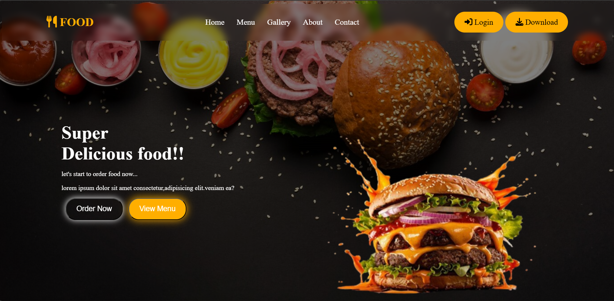

 # Food Website 🍔

This is a simple responsive food website built using HTML and CSS.  
It features animated components, a navigation bar, and a hero section with call-to-action buttons.

## Technologies Used
- HTML5
- CSS3
- Font Awesome Icons

## Preview

## How to Use
Just open `index.html` in your browser or host the project using GitHub Pages.
